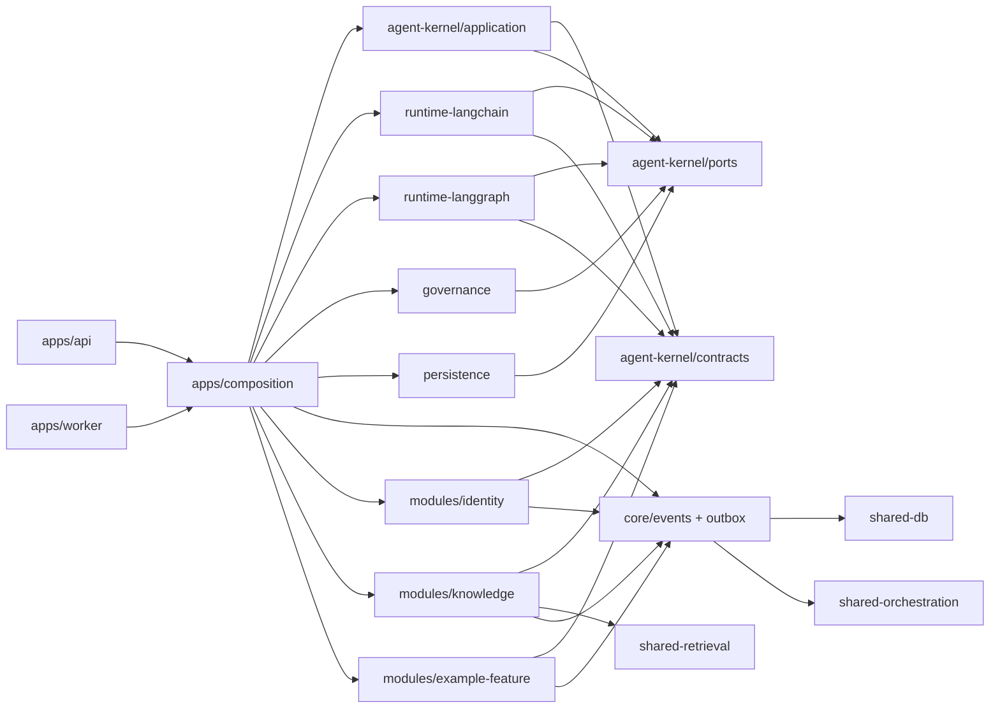

# Project Structure — LangChain/LangGraph

Cây thư mục ownership/dependency của project. Chọn stack cụ thể qua review kiến trúc trước khi thêm source code, package manifest và deployment config.

[Tài liệu kiến trúc](docs/architecture/index.md) · [packages/](packages/README.md) · [modules/](modules/README.md) · [Harness](docs/harness/HARNESS.md)

## Cây thư mục

```text
.
├── AGENTS.md / CLAUDE.md            # Agent entrypoints + Harness shim
├── README.md
├── STRUCTURE.md
├── apps/
│   ├── composition/                 # Bootstrap chung; nơi duy nhất wire modules + adapters
│   ├── api/                         # Channel/API adapter; auth và canonical stream translation
│   └── worker/                      # Durable workflow, event và background execution host
├── packages/                        # Platform libs — không chứa business domain
│   ├── agent-kernel/
│   │   ├── contracts/               # Pure DTO/schema; không vendor/framework types
│   │   ├── application/             # Agent use cases và lifecycle orchestration
│   │   └── ports/                   # Runtime, memory, checkpoint, approval, audit interfaces
│   ├── runtime-langchain/           # LangChain adapter: agent/tool/model integration
│   ├── runtime-langgraph/           # LangGraph adapter: graph, checkpoint, interrupt/resume
│   ├── governance/                  # Policy evaluation, permissions, HITL và budgets
│   ├── persistence/                 # Platform-owned stores và runtime store adapters
│   ├── core/                        # Event envelope, outbox, dispatcher, workers
│   ├── shared-types/                # Branded IDs, shared DTOs (type-only)
│   ├── shared-rbac/                 # Pure roles/permissions
│   ├── shared-db/                   # Pool, schema clients, migrations
│   ├── shared-config/               # Toolchain + boundary lint
│   ├── shared-crypto/               # Envelope encryption for secrets at rest
│   ├── shared-retrieval/            # Retrieve/rerank primitives
│   ├── shared-storage/              # Object storage + tenant keys
│   ├── shared-testing/              # Testcontainers, fakes, fixtures
│   ├── shared-embeddings/           # Embedding providers + routing
│   └── shared-orchestration/        # Queue/scheduler primitives; không có run registry
├── modules/                         # Domain modules — business truth + agent tools
│   ├── identity/                    # Optional: users, orgs, sessions, SSO, RBAC bindings
│   ├── knowledge/                   # Optional: tenant KB, RAG contribution
│   ├── integrations/                # Optional: credentials, connectors, external APIs
│   ├── notifications/               # Optional: in-app notify, preferences, delivery
│   ├── ingestion/                   # Optional: document/domain ingest pipelines
│   └── example-feature/             # Template feature nghiệp vụ
│       ├── domain/                  # Aggregate/rules/mutations; framework-independent
│       ├── application/             # Feature use cases và public surface
│       └── agent-tools/             # Pure specs + closures gọi feature public surface
├── config/
│   ├── policies/                    # Reviewed policy artifacts; secrets không đặt tại đây
│   └── prompts/                     # Versioned prompt assets; không chứa business truth
├── observability/                   # Telemetry schema, dashboards và alert definitions
├── infra/                           # Hạ tầng — hiện tại chỉ UAT FPT Cloud
│   └── fpt-cloud-uat/               # 1 Cloud Server + Compose (+ Object Storage backup)
├── .github/
│   ├── README.md
│   ├── dependabot.yml
│   ├── actions/build-images/        # Composite buildx + registry push
│   └── workflows/
│       ├── ci.yml                   # PR/main gates
│       ├── iac.yml                  # infra/** validation
│       ├── uat-release.yml          # Tag → registry → SSH deploy
│       ├── uat-rollback.yml
│       ├── uat-db-reset.yml
│       └── uat-clear-caches.yml
├── scripts/                         # harness-cli + schema (durable change tracking)
│   ├── bin/harness-cli              # local binary (gitignored; install/copy)
│   └── schema/
└── tests/
    ├── contract/                    # Port/adapter/canonical-event compatibility
    ├── integration/                 # Stores, tools, graph resume và tenant isolation
    └── e2e/                         # User flow, HITL, recovery và audit reconstruction
```

## Ownership

| Khu vực | Owner | Trách nhiệm | Không được sở hữu |
|---|---|---|---|
| `apps/composition` | Platform | Bootstrap registry chung cho API/worker | HTTP handler, graph node, domain rule |
| `apps/{api,worker}` | Delivery/platform | Transport/process lifecycle, gọi composition chung | Domain rules, vendor types trong public API |
| `agent-kernel/contracts` | Architecture/platform | Canonical context, stream, tool và execution refs | Runtime implementation |
| `agent-kernel/application` | Agent platform | Use cases, budgets, lifecycle, orchestration | Feature DB/domain internals |
| `agent-kernel/ports` | Architecture/platform | Dependency-inversion boundaries | Import adapters/frameworks |
| `runtime-langchain` | Agent platform | Implement agent/tool/model ports | Feature/domain imports, product state |
| `runtime-langgraph` | Agent platform | Implement workflow/checkpoint/interrupt ports | Approval system of record |
| `governance` | Security/risk/platform | Policy, authorization, HITL, execution limits | Prompt-only enforcement |
| `persistence` | Data/platform | Store adapters, migrations và tenant scoping | Cross-domain table access |
| `core` | Platform | Event envelope, outbox, dispatcher, workers | Business event catalog/domain rules |
| `shared-*` | Platform | Cross-cutting libs không sở hữu business state | Domain aggregates, agent run/workflow registry |
| `modules/*` | Domain teams | Business truth, public use cases, tool contributions | Runtime orchestration |
| `config/*` | Designated owners | Reviewed/versioned policies và prompts | Credentials, mutable runtime state |
| `observability` | SRE/platform | Telemetry contracts, SLOs, alerts | Chain-of-thought hoặc unredacted secrets |

## packages vs modules

| | `packages/` | `modules/` |
|---|---|---|
| Vai trò | Kernel, runtime, policy, stores, shared libs | Domain capability / feature |
| Có aggregate? | Không (trừ store kỹ thuật) | Có — `domain/` |
| Agent | Ports + adapters + governance | `agent-tools/` contribute specs/closures |
| Import | Không import `modules/*` (trừ `apps/composition`) | `contracts` + `shared-*` + public `core/events` |

## Dependency direction



Quy tắc:

1. Ports không import adapters; application không import LangChain/LangGraph trực tiếp.
2. Runtime adapters implement ports và không import module/domain implementation.
3. Module publish tool specs/closures qua public contribution; composition root collect
   và inject chúng vào runtime.
4. Module sở hữu business event schema; mutation emit qua public `core/events` trong cùng
   transaction. `core` không import module internals.
5. Tool closure gọi module public surface; domain callee re-check tenant/RBAC.
6. Product state, approvals và durable memory do platform/domain sở hữu. LangGraph checkpoint
   chỉ phục vụ execution recovery.
7. Channel adapters chuyển canonical events sang protocol cụ thể; vendor stream type không đi
   qua product API.

## Trình tự hiện thực hóa

1. Định nghĩa pure contracts và ports từ một read-only use case.
2. Tạo một runtime adapter và contract tests; chưa thêm write tool.
3. Thêm module contribution qua `apps/composition`; API và worker dùng cùng registry.
4. Bổ sung governance, persistence và canonical audit events.
5. Thêm deterministic graph/checkpoint; kiểm thử crash/resume.
6. Chỉ sau đó thêm write tool với HITL, idempotency và recovery.

Definition of done và rollout gates nằm trong [Lộ trình triển khai](docs/implementation-roadmap.md).
