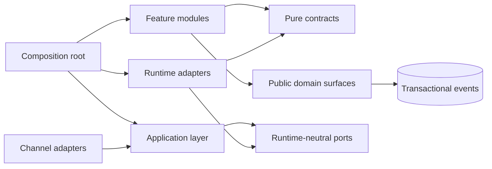

# Module và dependency boundaries

[← Mục lục](index.md)

## Dependency direction

Dependencies trỏ vào contracts/ports; port không import adapter. Runtime adapter không import
feature internals. Composition root là nơi duy nhất collect contributions và inject closure/spec
vào agent engine.

## Public contracts tối thiểu

- `ExecutionContext`: tenant, actor, permission claims, locale, request/correlation IDs, deadline.
- `AgentContract`: purpose, inputs, outputs, allowed tools, budgets và escalation.
- `ToolSpec`: typed schema, effect level, permission, approval, idempotency và timeout.
- `AgentStreamEvent`: lifecycle, text delta, tool call/result, interrupt, error và final result.
- `ExecutionRef`: run, checkpoint và interrupt identity không lộ vendor identifier ra product API.
- `DomainEvent`: module-owned business event schema; `core/events` chỉ cung cấp envelope,
  outbox mechanism và dispatch contract.
- Ports: chat runtime, workflow runtime, checkpoint store, durable memory, approval store và audit.

## Quy tắc crossing

| Crossing | Cho phép | Cấm |
|---|---|---|
| Agent → domain | Public function với context; callee re-check RBAC | Truy cập DB client/table nội bộ |
| Module → module | Public contract hoặc event đã schema-validate | Import internal implementation |
| Module → `core/events` | Emit module-owned `DomainEvent` trong transaction | Để `core` sở hữu business event/domain rule |
| Runtime → platform | Port implementation | Để vendor type lan vào domain/API |
| Mutation → audit | Transactional outbox hoặc atomic equivalent | Log best-effort sau khi mutation |
| Resume → workflow | Opaque `ExecutionRef` đã authorization | Tin checkpoint ID do client cung cấp |

## Ownership state

- **Platform-owned:** conversation, messages, approval decisions, workflow lifecycle, durable
  user/org memory và audit projection.
- **Runtime-owned qua port:** checkpoint phục vụ retry/resume/time travel.
- **Domain-owned:** aggregate, mutation và business event.
- **Provider-owned:** model inference telemetry theo data-processing agreement; không phải record
  chính thức.

## Validation kiến trúc

Đưa dependency rules trong
[`config/architecture-policy.yaml`](../../config/architecture-policy.yaml) vào CI: forbidden
imports, schema ownership, public-surface imports và contract tests cho adapters. Review bằng sơ
đồ không đủ để chống structural decay.
