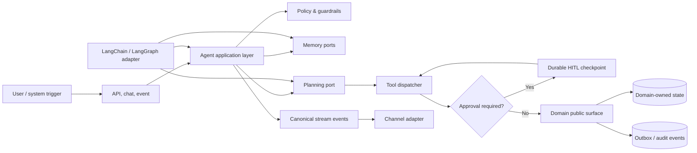

# Tổng quan kiến trúc

[← Mục lục](index.md)

## Mục tiêu

Kiến trúc tách **quyết định nghiệp vụ** khỏi **cơ chế agent runtime**. Model có thể đề xuất,
phân loại hoặc lập kế hoạch; platform vẫn sở hữu identity, policy, product state, approvals,
audit và side effects.

## Các lớp trách nhiệm

| Lớp | Sở hữu | Không sở hữu |
|---|---|---|
| Channels | Authentication, request/stream translation | Business decision, vendor event type |
| Application | Use case, run lifecycle, orchestration policy | Domain table, framework-specific state |
| Runtime adapter | Model loop, graph execution, checkpoint mechanism | Product record, permission truth |
| Policy | Risk classification, approval, execution budget | Tool implementation |
| Domain modules | Validation, authorization, mutation, domain events | Agent planning |
| Platform stores | Threads, approvals, durable memory, audit projection | Domain aggregate internals |

## Một vòng thực thi chuẩn

1. Entry adapter xác thực actor và tạo `ExecutionContext` gồm tenant, actor, permissions,
   correlation ID và deadline.
2. Application nạp context tối thiểu theo policy, không đổ toàn bộ lịch sử vào prompt.
3. Planner chọn deterministic workflow hoặc adaptive agent loop.
4. Dispatcher xác minh tool allowlist, schema input, budget và permission.
5. Write/risky action dừng tại durable approval checkpoint.
6. Domain callee re-check quyền, thực thi idempotently và phát audit/domain event cùng mutation.
7. Runtime checkpoint ghi trạng thái resume; product state vẫn do platform/domain sở hữu.
8. Canonical event stream được chuyển sang UI/API protocol tại channel adapter.

## Reliability envelope cần chốt

- Maximum steps, wall-clock timeout, token/cost budget và tool-call rate.
- Loại dữ liệu được phép đưa tới từng model/provider.
- Recovery khi model timeout, tool timeout, approval hết hạn hoặc worker crash.
- Idempotency scope và compensation cho từng external write.
- SLO cho first token, completion, approval wait, recovery time và audit availability.

